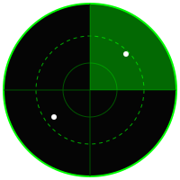

  
   
  <code>> ACCESSING CODERUDRA-X MAINFRAME...</code> 
  <code>> CLEARANCE LEVEL: S-RANK GRANTED.</code> 
  <code>> MISSION: OPERATION REBIRTH INITIATED.</code>

# &nbsp; Hi , I'm CODERUDRA-X

  

**A passionate  || AI Enthusiast || Building CODERUDRA-X Legacy**
# 🚀 CODERUDRA-X | Initiating Operation Rebirth. Several Defense-AI & Python projects are currently classified (private) for development. Declassifying soon...❄️

**> DIRECTIVE: SECURE COMM-LINK**
📧 **Ping the Mainframe:** [`harshgroups247@gmail.com`](mailto:harshgroups247@gmail.com) for Tactical Collabs & AI Projects.

**> CURRENT SYSTEM STATUS:**
- 🎯 **Executing:** Prototype VYUHA (Decentralized AI-Driven Drone Swarm Logic).
- 🧠 **Processing:** Advanced C++ (Deep DSA) & Predictive ML/AI Mathematics (MIT OCW).
- 🤝 **Open for Alliance:** Computer Vision, Simulations, and Autonomous Drone Architectures.
- 📡 **Seeking Intel:** Mentorship in scaling Defense-AI systems and complex architectures.
- 💬 **Query Me On:** Image Analysis, Automation pipelines, and the "Tier-3 to CEO" Mindset.
- ⚡ **Core Philosophy:** "The greatest battles are won by building a strong 'WHY' before writing a single line of code."

## 🛰️ ESTABLISHING COMM-LINKS (Tactical Connect)
<code>> ENCRYPTED LINE AVAILABLE // CLEARANCE GRANTED</code>
 

  
  
  
  
  
  
  

### 🛰️ Core Intelligence & Defense Tech

  

### 📊 Data Science & Mathematical Engineering

  

### ⚡ Automation & Cloud Infrastructure (GCP)

  

# 🛠️ Building in Stealth Mode. Cooking up some serious projects in private repositories. Stay tuned for the big push!

# HACKTOBERFEST👾

# 📊 LIVE TELEMETRY (GitHub Stats)

  
  
  

  

---

### 📜 THE SACRED PROTOCOLS

  

